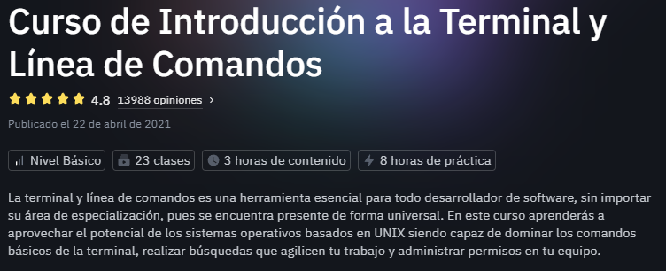
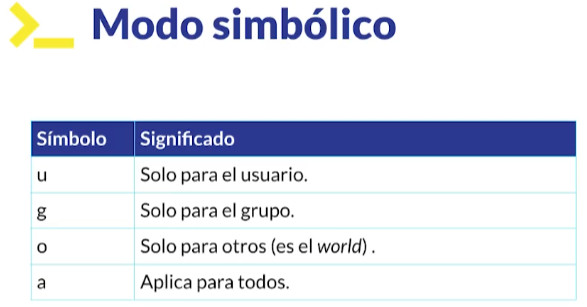

# Curso de Introducción a la Terminal y Línea de Comandos



## 🖥 **Terminal**

La terminal es una interfaz gráfica que muestra el **prompt** (línea de entrada de comandos), permitiendo al usuario interactuar con el sistema operativo mediante comandos.

## ⚙ **Línea de Comandos (Shell)**

El **Shell** es un programa que interpreta los comandos ingresados por el usuario y ejecuta las operaciones correspondientes en el sistema operativo.

## 🐚 **Tipos de Shell**

Existen diversos tipos de Shell, cada uno con sus propias características y funcionalidades:

| **Tipo de Shell** | **Descripción**                                                                                  |
|--------------------|--------------------------------------------------------------------------------------------------|
| **Bourne Shell (sh)**   | Uno de los primeros shells de Unix. Es simple y eficiente, pero con capacidades limitadas en scripting. |
| **Bash Shell**          | Evolución del Bourne Shell, ampliamente utilizado en Linux. Incluye funciones avanzadas y scripting poderoso. |
| **ZShell (zsh)**        | Shell interactivo moderno con autocompletado mejorado, personalización y plugins avanzados. |
| **C Shell (csh)**       | Diseñado para programación estructurada, incluye soporte para alias y variables.            |
| **Korn Shell (ksh)**    | Combina características del Bourne y C Shell, ideal para scripting avanzado.                |
| **Fish Shell**          | Shell interactivo amigable con autocompletado automático y sugerencias de comandos.         |
| **PowerShell**          | Línea de comandos avanzada de Windows con soporte para scripts en formato de objetos y comandos únicos. |

## Sistema de Archivos


En los sistemas operativos basados en Unix, la carpeta **"Home"** es donde se almacena la información del usuario.

### Comandos Básicos

- **`ls`**: Lista las carpetas y archivos en el directorio actual.
- **`clear`** (o `Ctrl + L`): Limpia la terminal.
  
#### Opciones Comunes para `ls`

- **`ls -l`**: Muestra una lista detallada de archivos y carpetas en formato largo.
- **`ls -lh`**: Muestra tamaños de archivos en formato legible para humanos (por ejemplo, KB, MB).
- **`ls -a`**: Muestra archivos ocultos.
- **`ls -S`**: Ordena los archivos por tamaño.
- **`ls -r`**: Muestra los archivos en orden inverso por nombre.

### Navegación de Directorios

- **`cd`**: Cambia al directorio **Home** rápidamente.
- **`pwd`**: Muestra la ruta completa del directorio actual (ruta absoluta).
- **`cd ..`**: Retrocede al directorio anterior.
- **`cd .`**: Se mantiene en el directorio actual.

#### Rutas

- **Relativas**: Usan **`..`** o **`.`** para moverse dentro de la estructura de directorios.
- **Absolutas**: Usan la ruta completa desde la raíz, como **`/home/josue`**.

### Verificación del Tipo de Archivo

- **`file`**: Describe el tipo de archivo. Ejemplo:

```bash
$ file package.json
package.json: JSON data
```

### Comando `tree`

- Muestra la estructura de los archivos y carpetas en forma de árbol. Usa el parámetro **`-L`** para definir los niveles de profundidad:

```bash
tree -L 2
```

## Manipulación de Archivos y Directorios

| **Comando**  | **Descripción**                                                       |
|--------------|-----------------------------------------------------------------------|
| **`mkdir`**  | Crea un nuevo directorio. Si contiene espacios, usa comillas: `mkdir "Mi Directorio"`. Se pueden crear múltiples directorios a la vez: `mkdir dir1 dir2 dir3`. |
| **`touch`**  | Crea un archivo vacío. Se pueden crear múltiples archivos de una vez: `touch file1 file2`. |
| **`cp`**     | Copia archivos. Si no se especifica la ruta de destino, se copia en el mismo directorio: `cp file1 file_bk`. |
| **`mv`**     | Mueve archivos o carpetas. También se usa para renombrar: `mv file_bk ../dir2` o `mv file_bk fileCopy`. |
| **`rm`**     | Elimina archivos. Usa **`-i`** para confirmar la eliminación de manera interactiva: `rm -i fileCopy`. Para directorios usa **`-r`** (recursivo): `rm -r dir1`. La opción **`-f`** fuerza la eliminación sin confirmación: `rm -rf dir1`. Tambipen se pueden eliminar múltiples archivos o directorios a la vez como **`rm -r dir1 dir2`**|

## Contenido de un Archivo

| **Comando** | **Descripción**                                                                 |
|-------------|---------------------------------------------------------------------------------|
| **`head`**  | Muestra las primeras 10 líneas de un archivo. Se puede modificar con **`-n`**: `head archivo.md -n 15`. |
| **`tail`**  | Muestra las últimas 10 líneas de un archivo, se puede modificar igual que `head`. |
| **`less`**  | Permite explorar un archivo de manera interactiva. Usa las flechas o el scroll para moverse, y **`/`** para buscar una palabra o frase. Para salir presiona **`q`**. |

### Abrir un Archivo en una Terminal

Para abrir una terminal en una ruta específica, se puede usar el siguiente comando:

```bash
explorer.exe ruta
```

Este comando abre el explorador de archivos en la ruta especificada.

## Comandos


### Ver la Naturaleza de un Comando

El comando **`type`** permite verificar la naturaleza de un comando. Ejemplo:

```bash
$ type cd
cd is a shell builtin
```

Algunos comandos son **alias**. Por ejemplo, el comando `ls` utiliza un alias para habilitar colores en la terminal:

```bash
$ type ls
ls is aliased to `ls --color=auto'
```

### Crear Alias

Puedes crear alias personalizados usando el comando **`alias`**. Ejemplo:

```bash
alias l="ls -lh"
```

> **Nota**: Estos alias son **temporales**. Más adelante se explicará cómo crear alias permanentes.

### Obtener Ayuda de Comandos

Hay varias formas de obtener ayuda sobre los comandos:

| **Comando**          | **Descripción**                                                                                   |
|-----------------------|---------------------------------------------------------------------------------------------------|
| **`help <comando>`**  | Muestra ayuda básica sobre un comando.                                                           |
| **`man <comando>`**   | Abre el manual completo de un comando.                                                           |
| **`info <comando>`**  | Proporciona información más resumida que `man`.                                                  |
| **`whatis <comando>`**| Proporciona una descripción breve del comando.                                                   |

Ejemplos:

```bash
help cd
cd --help
man ls
info ls
whatis cd
```

## Wildcards (Comodines)

Los **wildcards** son caracteres especiales que permiten usar patrones para búsquedas avanzadas y manipulación de archivos.

### Comodines Básicos

| **Wildcard** | **Descripción**                                                   | **Ejemplo**                                                                                   |
|--------------|-------------------------------------------------------------------|----------------------------------------------------------------------------------------------|
| **`*`**      | Coincide con **cualquier número de caracteres**.                  | **`ls *.txt`**: Lista todos los archivos que terminan en `.txt`.                             |
| **`?`**      | Coincide con **un solo carácter**.                                | **`ls datos?`**: Lista archivos como `datos1`.                                              |
| **`[ ]`**    | Coincide con **un rango o conjunto de caracteres específicos**.   | **`ls [ad]*`**: Lista archivos que comienzan con `a` o `d`.                                  |
| **`[[:upper:]]`** | Coincide con caracteres **en mayúsculas**.                  | **`ls -d [[:upper:]]*`**: Lista directorios que comienzan con mayúsculas.                   |
| **`[[:lower:]]`** | Coincide con caracteres **en minúsculas**.                  | **`ls -d [[:lower:]]*`**: Lista directorios que comienzan con minúsculas.                   |

### Ejemplos Prácticos

#### Usando `*` (Asterisco)

```bash
$ ls *.txt
dot.txt  dot2.txt  file.txt
```

```bash
$ ls datos*
datos1  datos123
```

#### Usando `?` (Interrogación)

```bash
$ ls datos?
datos1
```

```bash
$ ls datos???
datos123
```

#### Usando Rango de Caracteres `[ ]`

Lista directorios que comienzan con **mayúsculas**:

```bash
$ ls -d [[:upper:]]*
Lab4_CSS  Lab5_JS  LaptopUnveilingHTML  LaptopUnveilingHTML.rar  OverBlogWatch  OverBlogWatchApi
```

Lista directorios que comienzan con **minúsculas**:

```bash
$ ls -d [[:lower:]]*
abc     datos123  dir2     dot2.txt  go                           index.html    package-lock.json  postgresql.conf
datos1  dir1      dot.txt  file.txt  go1.22.5.linux-amd64.tar.gz  node_modules  package.json       snap
```

Filtrar por archivos/directorios que comienzan con letras específicas (`a` o `d`):

```bash
$ ls [ad]*
abc  datos1  datos123  dot.txt  dot2.txt
```

### Uso de Wildcards en Manipulación de Archivos

Los wildcards también son útiles con comandos como **`rm`**, **`cp`**, o **`mv`**:

- **`rm *.log`**: Elimina todos los archivos que terminan en `.log`.
- **`cp datos* backup/`**: Copia todos los archivos que comienzan con "datos" al directorio `backup`.
- **`mv [ad]* folder/`**: Mueve todos los archivos que comienzan con "a" o "d" al directorio `folder`.

## Redirecciones


Las redirecciones en la shell permiten manipular las salidas estándar, errores y entradas de los comandos. Cada flujo tiene un número asociado:

| **Flujo**             | **Número** |
|-----------------------|------------|
| **Entrada estándar**  | `0`        |
| **Salida estándar**   | `1`        |
| **Error estándar**    | `2`        |

Se utilizan los símbolos `>` y `>>` para redirigir o concatenar estos flujos hacia archivos o dispositivos.

### **Redirigir la Salida Estándar (`1`)**

Para guardar la salida de un comando en un archivo, usa el símbolo `>`:

```bash
ls Pictures > misFotos.txt
```

Esto captura la salida del comando `ls Pictures` y la guarda en el archivo `misFotos.txt`. Si el archivo ya existe, su contenido será sobrescrito.

### **Concatenar la Salida Estándar (`>>`)**

Si deseas **añadir** información al archivo en lugar de sobrescribirlo, utiliza `>>`:

```bash
ls Downloads >> misFotos.txt
```

Este comando agrega la salida del comando `ls Downloads` al final de `misFotos.txt` sin borrar el contenido existente.

### **Redirigir el Error Estándar (`2`)**

Para capturar errores de un comando en un archivo, usa `2>`:

```bash
ls skaond 2> error.txt
```

En este ejemplo, si el comando `ls skaond` genera un error, dicho error se guarda en el archivo `error.txt`.

### **Redirigir Ambos Flujos: Salida y Error**

Puedes redirigir simultáneamente la salida estándar y el error estándar a un solo archivo usando `2>&1`:

```bash
ls sjdoai > output.txt 2>&1
```

- **`> output.txt`**: Redirige la salida estándar al archivo `output.txt`.
- **`2>&1`**: Indica que el error estándar (`2`) debe redirigirse al mismo lugar que la salida estándar (`1`).

Esto asegura que tanto la salida como los errores se capturen en el archivo `output.txt`.

### **Usar la Entrada Estándar (`0`)**

Es posible redirigir datos desde un archivo o dispositivo hacia la entrada de un comando:

```bash
cat < archivo.txt
```

Aquí, `archivo.txt` se usa como entrada para el comando `cat`.

### **Combinaciones Avanzadas**

1. **Redirigir Salida Estándar y Error a Archivos Diferentes**:

   ```bash
   comando > salida.txt 2> errores.txt
   ```

   - `> salida.txt`: Guarda la salida estándar en `salida.txt`.
   - `2> errores.txt`: Guarda el error estándar en `errores.txt`.

2. **Silenciar la Salida Estándar**:

   Para descartar la salida estándar, redirígela a `/dev/null`:

   ```bash
   comando > /dev/null
   ```

   Esto elimina cualquier salida del comando.

3. **Silenciar Ambos Flujos**:

   Para descartar tanto la salida estándar como los errores:

   ```bash
   comando > /dev/null 2>&1
   ```

### **Resumen de Operadores de Redirección**

| **Operador**  | **Descripción**                                                                 |
|---------------|---------------------------------------------------------------------------------|
| `>`           | Redirige la salida estándar (sobrescribe el archivo de destino).               |
| `>>`          | Redirige la salida estándar (concatena al archivo de destino).                 |
| `2>`          | Redirige el error estándar (sobrescribe el archivo de destino).                |
| `2>>`         | Redirige el error estándar (concatena al archivo de destino).                  |
| `<`           | Redirige la entrada estándar desde un archivo.                                 |
| `/dev/null`   | Descartar la salida o errores (útil para silenciar comandos).                  |
| `2>&1`        | Combina la salida estándar y el error estándar en el mismo destino.            |

### **Ejemplo Completo**

```bash
ls archivos > salida.txt 2> errores.txt
```

En este ejemplo:

- La salida estándar de `ls archivos` se guarda en `salida.txt`.
- Los errores generados (si los hay) se guardan en `errores.txt`.

## Operador Pipe (`|`)

El operador **pipe** (`|`) permite redirigir la salida estándar de un comando hacia la entrada estándar de otro. Es una herramienta poderosa para crear flujos de procesamiento en la shell, facilitando la manipulación de datos sin necesidad de archivos intermedios.

### **Comandos Básicos Usados con Pipe**

1. **`echo`**:
   Muestra texto o variables en la salida estándar:

   ```bash
   echo "Hola, mundo"
   ```

2. **`cat`**:
   Muestra el contenido de un archivo o combina múltiples archivos en la salida estándar:

   ```bash
   cat archivo.txt
   ```

   También puede redirigir su entrada desde un archivo:

   ```bash
   cat < archivo.txt
   ```

### **Usando el Operador Pipe**

El pipe toma la salida estándar de un comando y la redirige como entrada estándar de otro. Ejemplo básico:

```bash
ls -lh | less
```

- **`ls -lh`**: Genera una lista detallada de archivos.
- **`less`**: Permite explorar la salida de forma interactiva (avanzar, retroceder y buscar).

### **Creando Archivos con `tee`**

El comando `tee` guarda la salida estándar en un archivo y simultáneamente la pasa como entrada a otro comando. Ejemplo:

```bash
ls -lh | tee output.txt | less
```

- **`ls -lh`**: Lista archivos.
- **`tee output.txt`**: Guarda la salida en el archivo `output.txt` y la envía a `less`.
- **`less`**: Muestra la salida en una interfaz interactiva.

Esto evita la necesidad de realizar múltiples redirecciones manualmente.

### **Ejemplo Complejo con `sort`**

Podemos combinar varios comandos con pipes. Por ejemplo, ordenar una lista, guardarla y visualizarla interactivamente:

```bash
ls -lh | sort | tee output.txt | less
```

- **`sort`**: Ordena alfabéticamente la salida de `ls`.
- **`tee`**: Guarda el resultado en `output.txt`.
- **`less`**: Permite interactuar con el resultado.

### **Mostrando Mensajes en Colores**

Los pipes también funcionan con comandos para personalizar la salida. Por ejemplo:

```bash
cowsay "Hola mundo" | lolcat
```

- **`cowsay`**: Genera un mensaje dentro de un bocadillo de texto acompañado de una vaca ASCII.
- **`lolcat`**: Aplica colores degradados al texto.

Salida:

```markdown
 ____________
< hola mundo >
 ------------
        \   ^__^
         \  (oo)\_______
            (__)\       )\/\
                ||----w |
                ||     ||
```

### **Librería `sharutils`**

La biblioteca **sharutils** proporciona herramientas para codificar y decodificar archivos en formatos especiales, como `uuencode` y `uudecode`, usados para empaquetar y compartir archivos en sistemas UNIX.

#### **Instalación**

Para instalar la biblioteca en sistemas basados en Debian:

```bash
sudo apt install sharutils
```

#### **Codificar un Archivo: `uuencode`**

El comando `uuencode` convierte un archivo en un formato seguro para transmisión (por ejemplo, por correo electrónico). Ejemplo:

```bash
uuencode archivo.txt archivo_codificado.txt > archivo.uu
```

- **`archivo.txt`**: Archivo original.
- **`archivo_codificado.txt`**: Nombre que tendrá el archivo después de ser decodificado.
- **`archivo.uu`**: Salida codificada.

#### **Decodificar un Archivo: `uudecode`**

Para recuperar un archivo codificado con `uuencode`, usa `uudecode`:

```bash
uudecode archivo.uu
```

Esto genera el archivo original (`archivo_codificado.txt`) en el directorio actual.

#### **Flujo Completo**

1. Codificar un archivo:

   ```bash
   uuencode archivo.txt archivo.txt > archivo.uu
   ```

2. Compartir el archivo `archivo.uu`.

3. Decodificar en otro sistema:

   ```bash
   uudecode archivo.uu
   ```

El archivo original estará disponible con el mismo nombre especificado durante la codificación.

## Operadores de Control

Los operadores de control en la shell son símbolos reservados que permiten ejecutar y encadenar múltiples comandos de diversas maneras. Estos operadores son útiles para controlar el flujo de ejecución, ejecutar comandos condicionalmente, o correr tareas en segundo plano.

### **Ejecución Secuencial con `;`**

El operador `;` permite ejecutar múltiples comandos de forma secuencial. Cada comando se ejecuta en orden, sin importar si el anterior tuvo éxito o no. Ejemplo:

```bash
ls; mkdir hola; cal
```

- **`ls`**: Lista los archivos del directorio actual.
- **`mkdir hola`**: Crea un directorio llamado `hola`.
- **`cal`**: Muestra el calendario del mes actual.

En este caso, todos los comandos se ejecutan uno tras otro, independientemente de su resultado.

### **Ejecución en Segundo Plano con `&`**

El operador `&` ejecuta comandos de manera asíncrona, es decir, cada comando se ejecuta en segundo plano en un hilo del procesador. Esto es útil para correr múltiples tareas simultáneamente.

```bash
ls & date & cal
```

Salida típica:

```bash
[1] 147207
[2] 147208
Wed Dec 18 14:20:49 CST 2024
Lab4_CSS                 OverBlogWatch                hola               postgresql.conf
Lab5_JS                  OverBlogWatchApi             node_modules       snap
LaptopUnveilingHTML      go                           package-lock.json
LaptopUnveilingHTML.rar  go1.22.5.linux-amd64.tar.gz  package.json
   December 2024
Su Mo Tu We Th Fr Sa
 1  2  3  4  5  6  7
 8  9 10 11 12 13 14
15 16 17 18 19 20 21
22 23 24 25 26 27 28
29 30 31

[1]-  Done                    ls --color=auto
[2]+  Done                    date
```

- **`ls &`**: Lista los archivos del directorio en segundo plano.
- **`date &`**: Muestra la fecha y hora actuales en segundo plano.
- **`cal &`**: Muestra el calendario en segundo plano.

Cada tarea genera un identificador de proceso (PID) y un indicador del estado (`Done` cuando termina).

### **Ejecución Condicional con `&&`**

El operador `&&` asegura que el segundo comando se ejecutará solo si el primero tiene éxito (código de salida `0`). Este operador es ideal para comandos que dependen del éxito de un paso previo.

```bash
mkdir test && cd test
```

- **`mkdir test`**: Crea un directorio llamado `test`.
- **`cd test`**: Cambia al directorio `test` si fue creado con éxito.

Si `mkdir test` falla (por ejemplo, si el directorio ya existe), `cd test` no se ejecutará.

### **Ejecución Alternativa con `||`**

El operador `||` ejecuta el segundo comando solo si el primero falla (código de salida distinto de `0`). Este operador es útil para definir acciones alternativas.

```bash
mkdir hola || echo "El directorio ya existe"
```

- **`mkdir hola`**: Intenta crear un directorio llamado `hola`.
- **`echo "El directorio ya existe"`**: Muestra un mensaje si `mkdir hola` falla.

### **Combinaciones de Operadores**

Es posible combinar múltiples operadores para lograr un flujo de control más complejo. Ejemplo:

```bash
mkdir nueva_carpeta && cd nueva_carpeta || echo "Error al crear o entrar en el directorio"
```

- **`mkdir nueva_carpeta && cd nueva_carpeta`**: Intenta crear un directorio y cambiar a él si tiene éxito.
- **`|| echo "Error al crear o entrar en el directorio"`**: Muestra un mensaje si cualquiera de los pasos falla.

### **Ejemplo Complejo**

Un flujo completo que combina varios operadores:

```bash
mkdir proyecto && cd proyecto && touch main.py || echo "Error al configurar el proyecto"
```

1. Crea el directorio `proyecto`.
2. Cambia al directorio `proyecto`.
3. Crea un archivo vacío `main.py`.
4. Si falla cualquiera de los pasos, muestra un mensaje de error.

## Manejo de Permisos

En sistemas operativos basados en Unix/Linux, cada archivo o carpeta tiene asociados permisos que controlan quién puede acceder y qué acciones se pueden realizar sobre ellos. Cuando listamos archivos o carpetas con el comando `ls -l`, podemos observar una representación de permisos en el siguiente formato:

```bash
-rw-r--r--  1 usuario grupo  tamaño fecha nombre
```

### **Identificación de Archivos y Carpetas**

La primera columna de `ls -l` identifica si el elemento es un archivo (`-`) o una carpeta (`d`), seguida de una representación de los permisos.


### **Usuarios en el Sistema**

Existen tres tipos de usuarios para cada archivo o carpeta:

1. **Dueño (user)**: Generalmente el creador del archivo.
2. **Grupo (group)**: Usuarios que pertenecen a un grupo asociado al archivo.
3. **Otros (others)**: Cualquier otro usuario no incluido en los dos anteriores.


### **Tipos de Permisos**

Cada usuario puede tener tres tipos de permisos:

- **Lectura (`r`)**: Permite leer el contenido del archivo o listar los contenidos de una carpeta.
- **Escritura (`w`)**: Permite modificar el archivo o agregar/eliminar elementos en una carpeta.
- **Ejecución (`x`)**: Permite ejecutar un archivo como un programa o acceder a una carpeta.

La forma en que estos permisos afectan archivos y carpetas puede variar:


### **Representación Binaria y Octal de Permisos**

Los permisos se representan como un conjunto de tres bits para cada usuario (dueño, grupo, otros). Cada bit indica si el permiso está activado (`1`) o no (`0`):

- **Lectura (`r`)**: Bit más significativo.
- **Escritura (`w`)**: Bit intermedio.
- **Ejecución (`x`)**: Bit menos significativo.

| **Permiso** | **Binario** | **Octal** |
|-------------|-------------|-----------|
| Ninguno     | `000`       | `0`       |
| Ejecución   | `001`       | `1`       |
| Escritura   | `010`       | `2`       |
| Lectura     | `100`       | `4`       |

Ejemplo de representación octal para `rwxr-xr--`:


### **Modificación de Permisos con `chmod`**

#### **Usando el Modo Octal**

Con `chmod`, podemos establecer permisos directamente usando su representación octal. Por ejemplo:

```bash
chmod 755 archivo.txt
```

- **`7` (rwx)**: Permisos para el dueño.
- **`5` (r-x)**: Permisos para el grupo.
- **`5` (r-x)**: Permisos para otros.

Resultado:

```bash
-rwxr-xr-x 1 usuario grupo tamaño fecha archivo.txt
```

#### **Usando el Modo Simbólico**

En el modo simbólico, podemos agregar o quitar permisos para tipos específicos de usuarios:



Ejemplo de eliminación y adición de permisos:

```bash
chmod u-r archivo.txt
ls -l
--wxr-xr-x 1 usuario grupo tamaño fecha archivo.txt

chmod u+r archivo.txt
ls -l
-rwxr-xr-x 1 usuario grupo tamaño fecha archivo.txt
```

Podemos combinar múltiples cambios en un solo comando:

```bash
chmod u-x,go=w archivo.txt
ls -l
-rw--w--w- 1 usuario grupo tamaño fecha archivo.txt
```

### **Comprobación de Usuarios y Grupos**

Para verificar información sobre el usuario actual:

- **`whoami`**: Muestra el nombre del usuario actual.
- **`id`**: Proporciona información detallada del usuario, incluyendo grupos.

### **Cambio de Usuario y Uso de `sudo`**

#### **Cambio Temporal con `su`**

El comando `su` permite cambiar de usuario. Por ejemplo, para cambiar al usuario `root`:

```bash
sudo su root
```

#### **Ejemplo de Archivos con Diferentes Dueños**

```bash
$ ls -l
-rw--w--w- 1 josue adduser 45 Dec 18 16:27 archivo.txt
-rw-r--r-- 1 root  root      0 Dec 18 20:36 archivo_root.txt
```

El archivo `archivo_root.txt` pertenece al usuario `root`. Si intentamos eliminarlo como un usuario sin permisos:

```bash
rm archivo_root.txt
rm: remove write-protected regular empty file 'archivo_root.txt'?
```

Con `sudo`, podemos eliminarlo otorgando permisos temporales:

```bash
sudo rm archivo_root.txt
```

### **Cambio de Contraseña**

El comando `passwd` permite cambiar la contraseña del usuario actual:

```bash
passwd
```

### **Links simbólicos**

Podemos crear archivos con enlaces simbólicos que actúan como accesos directos. Por ejemplo:

```bash
ln -s Documents/Dev Desarrollo
```

Esto creará un enlace simbólico llamado `Desarrollo` que apunta a la carpeta `Documents/Dev`. Al hacer `cd Desarrollo` y luego `ls`, veremos los archivos de la carpeta destino.

## Variables de Entorno

Las variables de entorno son una herramienta poderosa en sistemas operativos tipo Unix. Permiten configurar el entorno del usuario y realizar tareas automatizadas mediante scripts. A continuación, se explica cómo utilizarlas y gestionarlas.

### Ver variables de entorno

Para listar las variables de entorno disponibles, usamos:

```bash
printenv
```

Si queremos consultar una variable específica, utilizamos:

```bash
echo $NOMBRE_VARIABLE
```

Por ejemplo:

```bash
echo $HOME
```

Esto imprimirá la ruta del directorio personal del usuario.

### Variable `PATH`

La variable `PATH` contiene las rutas donde el sistema busca los ejecutables. Al instalar ciertos programas o paquetes, puede ser necesario añadir su ubicación a `PATH`. Esto se hace con el siguiente comando:

```bash
PATH=$PATH:/ruta_a_binarios
```

Por ejemplo, si instalamos un paquete cuyo binario está en `/usr/local/mybin`, lo añadimos así:

```bash
PATH=$PATH:/usr/local/mybin
```

### Modificar variables de entorno

Para persistir cambios en las variables de entorno, editamos el archivo de configuración de la shell que estamos utilizando. Por ejemplo:

- **Bash**: Archivo `.bashrc`.
- **Zsh**: Archivo `.zshrc`.

### Crear alias

Un alias permite asignar un comando a una palabra clave para simplificar tareas frecuentes. Por ejemplo:

```bash
alias repositorios='cd /mnt/d/GitHub\ Repositorios'
```

Después de guardar el alias en el archivo `.bashrc` o `.zshrc`, lo cargamos con:

```bash
source ~/.bashrc
```

Ahora, escribir `repositorios` ejecutará el comando completo.

### Crear variables de entorno personalizadas

Para crear una variable personalizada:

```bash
WELCOME="Hola Mundo"
```

Si queremos asegurarnos de que la variable esté disponible en nuevas sesiones, añadimos esta línea al archivo `.bashrc` o `.zshrc`. Luego, cargamos los cambios:

```bash
source ~/.bashrc
```

Y verificamos con:

```bash
$echo $WELCOME
Hola Mundo
```

## Comandos de Búsqueda

Los comandos de búsqueda son herramientas esenciales para localizar archivos, binarios, o patrones dentro de archivos de texto. Aquí se explica cómo usarlos eficazmente.

### Comando `which`

El comando `which` se utiliza para encontrar la ubicación de un binario (programa) en el sistema. Por ejemplo, para encontrar la ubicación de Visual Studio Code:

```bash
which code
```

Esto devolverá la ruta completa del binario `code` si está instalado en el sistema.

---

### Comando `find`

El comando `find` se usa para buscar archivos en un directorio o ruta específica. Su sintaxis es:

```bash
find <ruta de búsqueda inicial> -name <nombre_del_archivo>
```

Por ejemplo, para buscar todos los archivos llamados `documento.txt` dentro del directorio actual:

```bash
find ./ -name "documento.txt"
```

**Buscar por tipo**: Puedes especificar el tipo de archivo o directorio con los parámetros `-f` para archivos y `-d` para directorios. Por ejemplo:

```bash
find ./ -type f -name "*.log"  # Buscar archivos .log
find ./ -type d -name "logs"   # Buscar directorios llamados "logs"
```

**Buscar por tamaño**: Para encontrar archivos de un tamaño específico, puedes usar el parámetro `-size`. Por ejemplo, para encontrar archivos de 20 MB:

```bash
find ./ -size 20M
```

**Ejercicio**: Buscar archivos `.txt` y guardarlos en un archivo con un mensaje de éxito:

```bash
find ./ -name "*.txt" >> misArchivosTXT && echo "Archivos guardados exitosamente" || echo "No se pudo hacer la operación"
```

## Comando `grep`

El comando `grep` busca coincidencias de un patrón en archivos de texto. La sintaxis básica es:

```bash
grep <expresión_regular> <archivo>
```

**Ejemplo básico**:

```bash
grep Towers movies.csv
```

Este comando buscará la palabra "Towers" en el archivo `movies.csv`. Es sensible a mayúsculas y minúsculas por defecto.

**Ignorar mayúsculas/minúsculas**: Para hacer una búsqueda insensible a mayúsculas y minúsculas, agrega el parámetro `-i`:

```bash
grep -i the movies.csv
```

**Contar coincidencias**: Para contar cuántas veces aparece un patrón en el archivo, usa el parámetro `-c`:

```bash
echo "Hay $(grep -c the movies.csv) movies usando el comando grep -c the movies.csv" >> conteo_movies
echo "Hay $(grep -c -i the movies.csv) movies usando el comando grep -c -i the movies.csv" >> conteo_movies
```

**Comparar resultados con y sin `-i`**:

```bash
[ $(grep -c the movies.csv) -gt $(grep -c -i the movies.csv) ] && echo "Hay más películas sin el parámetro -i" || echo "Hay más películas con el parámetro -i" >> conteo_movies
```

**Buscar líneas que no coincidan con un patrón**: Usa el parámetro `-v` para excluir las coincidencias:

```bash
grep -vi towers movies.csv
```

---

## Comando `wc`

El comando `wc` (word count) cuenta palabras, líneas, y caracteres en un archivo. Por ejemplo:

```bash
wc movies.csv
```

Esto devuelve 4 números:

- **Número de líneas**
- **Número de palabras**
- **Número de caracteres**
- **Nombre del archivo**

**Contar líneas**:

```bash
wc -l movies.csv
```

**Contar palabras**:

```bash
wc -w movies.csv
```

**Contar caracteres**:

```bash
wc -c movies.csv
```

## Utilidades de Red

Existen varios comandos útiles para interactuar con la red y obtener información sobre la conexión y el estado de los recursos en línea.

### Comando `ifconfig`

El comando `ifconfig` se utiliza para mostrar la configuración de red, incluyendo las interfaces de red activas, las direcciones IP y otros detalles de la red. Este comando es común en sistemas basados en Unix.

---

### Comando `ping`

El comando `ping` permite verificar si un sitio web o una dirección IP está activa. Envía paquetes ICMP y muestra el tiempo que tarda en recibir una respuesta.

```bash
ping www.google.com
```

Si se recibe una respuesta, significa que el servidor está activo.

---

### Comando `curl`

El comando `curl` se utiliza para transferir datos a través de la red, obteniendo archivos o contenido de una URL. Por ejemplo, puedes obtener el HTML de una página web de la siguiente manera:

```bash
curl www.google.com
```

---

### Comando `wget`

`wget` es una herramienta de línea de comandos utilizada para descargar archivos desde la web. A diferencia de `curl`, que generalmente obtiene datos, `wget` guarda directamente los archivos en el sistema local. Por ejemplo:

```bash
wget www.google.com
```

Esto descargará la página principal de Google.

---

### Comando `traceroute`

`traceroute` muestra la ruta que toman los paquetes a través de diferentes dispositivos de red hasta llegar a su destino. Es útil para diagnosticar problemas de conectividad y ver el trayecto que siguen los paquetes.

```bash
traceroute www.google.com
```

Ejemplo de salida:

```bash
traceroute to www.google.com (172.217.2.196), 30 hops max, 60 byte packets
 1  192.168.160.1 (192.168.160.1)  0.353 ms  0.276 ms  0.326 ms
 2  192.168.0.1 (192.168.0.1)  3.517 ms  3.906 ms  4.947 ms
 3  100.64.253.3 (100.64.253.3)  19.726 ms 100.64.253.2 (100.64.253.2)  19.577 ms 100.64.253.3 (100.64.253.3)  22.443 ms
 4  100.64.234.109 (100.64.234.109)  20.451 ms  22.559 ms 100.64.234.105 (100.64.234.105)  19.741 ms
...
14  mia09s02-in-f4.1e100.net (172.217.2.196)  47.082 ms  43.462 ms  48.621 ms
```

---

### Comando `netstat -i`

El comando `netstat -i` muestra una lista de las interfaces de red y sus estadísticas, como el número de paquetes transmitidos y recibidos, errores, y otras métricas relacionadas con la red.

```bash
netstat -i
```

## Comprimir Archivos

### Crear una carpeta y archivos para comprimir

Puedes crear una carpeta con archivos para comprimir:

```bash
mkdir ToCompress
cd ToCompress
touch file1 file2 file3
cd ..
tree ToCompress
```

### Comprimir archivos con `tar`

El comando `tar` es comúnmente utilizado para crear archivos comprimidos. Para comprimir una carpeta llamada `ToCompress` en un archivo `.tar`:

```bash
tar -cvf ToCompress.tar ToCompress
```

- `c` para crear un archivo comprimido
- `v` para mostrar los detalles del proceso
- `f` para especificar el nombre del archivo comprimido

### Comprimir archivos con formato `.tar.gz`

Para crear un archivo comprimido en formato `.tar.gz`, añade la opción `z`:

```bash
tar -cvzf ToCompress.tar.gz ToCompress
```

### Descomprimir archivos `.tar.gz`

Para descomprimir un archivo `.tar.gz`, usa el siguiente comando:

```bash
tar -xzvf ToCompress.tar.gz
```

- `x` para extraer
- `z` para descomprimir formato `.gz`
- `v` para mostrar detalles
- `f` para especificar el archivo

### Comprimir archivos con `zip`

El comando `zip` se puede utilizar para comprimir directorios en formato `.zip`:

```bash
zip -r ToCompressInZip.zip ToCompress
```

### Descomprimir archivos `.zip`

Para descomprimir un archivo `.zip`, usa el siguiente comando:

```bash
unzip ToCompressInZip.zip
```

### Diferencias entre formatos para comprimir

| **Comando** | **Formato**        | **Uso Principal**                                                                 | **Comprimir**                             | **Descomprimir**                          | **Ventajas**                                                                                 | **Desventajas**                                                                                       |
|-------------|--------------------|-----------------------------------------------------------------------------------|------------------------------------------|-------------------------------------------|------------------------------------------------------------------------------------------------|------------------------------------------------------------------------------------------------------|
| `tar`       | `.tar`             | Archivo empaquetado sin compresión. Ideal para combinar varios archivos en uno solo. | `tar -cvf archivo.tar directorio`        | `tar -xvf archivo.tar`                    | Puede empaquetar muchos archivos y directorios en un solo archivo.                              | No comprime los archivos, solo los empaqueta.                                                           |
| `tar.gz`    | `.tar.gz`          | Archivo empaquetado y comprimido en formato gzip. Comúnmente usado para respaldo.   | `tar -cvzf archivo.tar.gz directorio`    | `tar -xzvf archivo.tar.gz`                | Proporciona compresión con un buen ratio de compresión.                                           | Puede ser más lento para comprimir y descomprimir en comparación con `zip`.                           |
| `zip`       | `.zip`             | Archivo comprimido. Muy usado en Windows y compatible con muchas plataformas.      | `zip -r archivo.zip directorio`          | `unzip archivo.zip`                       | Es ampliamente utilizado, especialmente en sistemas Windows.                                         | La compresión no es tan eficiente como `tar.gz` en la mayoría de los casos.                          |

## Manejo de procesos

### **Comando `ps`**

El comando `ps` muestra los procesos que están en ejecución en el sistema, proporcionando información como el PID (Process ID). Por ejemplo:

```bash
ps aux
```

Esto lista todos los procesos con detalles como el usuario que los ejecuta, el PID, el uso de CPU y memoria, etc.

### **Comando `kill`**

Para eliminar un proceso, se usa el comando `kill` seguido del PID del proceso que quieres finalizar:

```bash
kill <PID>
```

Si el proceso no se detiene, se puede usar `kill -9 <PID>` para forzar su terminación.

### **Comando `top`**

El comando `top` abre una interfaz interactiva donde puedes ver los procesos en tiempo real. Puedes hacer filtros, por ejemplo, presionando `u` y luego ingresando el nombre del usuario del proceso para ver solo los procesos de ese usuario. Para obtener ayuda en esta interfaz, puedes presionar `h`.

## Procesos en Foreground y Background

### **Foreground**

Cuando un proceso está en el "foreground", significa que se ejecuta directamente en la terminal y bloquea la entrada de nuevos comandos hasta que termine. Por ejemplo, al ejecutar:

```bash
cat > mi_nota.txt
```

Esto actúa como un editor de texto temporal, y para finalizar y guardar el archivo, presionamos `CTRL + D`.

### **Background**

Un proceso en "background" se ejecuta sin ocupar la terminal, permitiendo que puedas seguir trabajando en otros comandos. Para enviar un proceso al background, puedes usar `CTRL + Z`, lo cual suspende el proceso, y luego usar el comando `bg` para reanudarlo en segundo plano:

```bash
bg <id_job>
```

Donde `<id_job>` es el identificador del proceso en segundo plano. Puedes ver la lista de trabajos con el comando `jobs`.

### **Ejemplo con "&"**

Otra manera de enviar un proceso al background es añadiendo el símbolo `&` al final del comando:

```bash
cat > mi_nota.txt &
```

Este comando ejecuta el proceso en segundo plano desde el principio.

---

### **Comandos adicionales**

Cuando un proceso está en background, puedes enviarlo nuevamente al foreground con:

```bash
fg <id_job>
```

Por ejemplo, si abres un navegador y luego lo suspendes con `CTRL + Z`, puedes reanudarlo en segundo plano usando:

```bash
bg <id_job_navegador>
```

Esto permitirá que el navegador siga ejecutándose en segundo plano mientras puedes usar la terminal para otras tareas.

## Editores de Texto en Terminal

Algunas opciones populares para editar texto en la terminal son **vim**, **emacs**, y **nano**.

En el caso de **vim**, existen dos versiones principales: **vi** (versión antigua) y **vim** (versión moderna). Aquí hay algunos detalles para comenzar con vim:

- **Crear un archivo de texto**: Utiliza el comando `vim index.html` para abrir o crear el archivo.
- **Editar texto**: Presiona `i` para entrar en el modo de inserción y comenzar a editar.
- **Resaltado de sintaxis**: Vim resalta la sintaxis dependiendo del lenguaje automáticamente.
- **Salir de la edición**: Presiona `ESC` para salir del modo de inserción.
- **Salir de vim**: Usa `:q` para salir.
- **Buscar palabras**: Usa `/palabra` para buscar y posicionarte en la primera coincidencia (no resalta las palabras).
- **Eliminar líneas**: Ve al inicio de la línea en el modo de navegación y presiona `d`.

---

### Personalizar la Terminal de Comandos

[**Oh My Posh**](https://ohmyposh.dev/) es una herramienta excelente para personalizar la apariencia de la terminal. Aquí se explica cómo hacerlo dependiendo de la configuración:

---

#### **PowerShell**

**Video referencia**: [PowerShell Video](https://www.youtube.com/watch?v=6SGIFVJ5Izs)

1. **Instalar la terminal de Microsoft Store**: Descarga la herramienta "Terminal" para manejar múltiples shells en una sola aplicación.
2. **Verificar que Winget esté instalado**: En versiones modernas de Windows (> Windows 10) debería estar incluido. Confírmalo con:

   ```bash
   winget --version
   ```

3. **Configurar la terminal**:
   - Abre **Settings** y configura las siguientes opciones base:
     - **Startup**:
       - Establece la shell predeterminada.
       - Define si la terminal debe abrirse automáticamente al iniciar la PC.
       - 
     - **Color schemes**:
       - Crea una paleta de colores personalizada. Aquí tienes un ejemplo:

         ```json
         {
           "background": "#2A2B37",
           "black": "#21222C",
           "blue": "#BD93F9",
           "brightBlack": "#6272A4",
           "brightBlue": "#D6ACFF",
           "brightCyan": "#A4FFFF",
           "brightGreen": "#69FF94",
           "brightPurple": "#FF92DF",
           "brightRed": "#FF6E6E",
           "brightWhite": "#FFFFFF",
           "brightYellow": "#FFFFA5",
           "cursorColor": "#FF79C6",
           "cyan": "#8BE9FD",
           "foreground": "#F8F8F2",
           "green": "#50FA7B",
           "name": "schemaPersonality",
           "purple": "#FF79C6",
           "red": "#FF5555",
           "selectionBackground": "#44475A",
           "white": "#F8F8F2",
           "yellow": "#F1FA8C"
         }
         ```

         - Coloca este esquema en el archivo JSON de configuración de la terminal en el aparatado `Profile` y subapartado del listado de `schemes`, que puedes abrir desde **"Open JSON file"** en la sección de settings. Luego, cierra el archivo json y en settings selecciona tu nuevo esquema en **Color schemes** y hazlo predeterminado.

         

     - **Defaults**:
       - Cambia el esquema de color por defecto.
       - Configura una fuente (recomendado usar una Nerd Font para íconos).
       - Ajusta la transparencia, el cursor, el padding y más.

   - ¡Explora las configuraciones para personalizar cada shell individualmente!

      

      

---

##### **Instalar Oh My Posh**

1. Instala **Oh My Posh** con Winget:

   ```bash
   winget install JanDeDobbeleer.OhMyPosh -s winget
   ```

2. Instala fuentes compatibles con Nerd Icons:

   ```bash
   oh-my-posh font install
   ```

   - Selecciona una fuente como **Fira Code Nerd Font** o cualquier otra.
   - Configura la fuente en **Settings/Appearance/Font face**.

3. Configura un tema:
   - Revisa los temas disponibles: [Oh My Posh Themes](https://ohmyposh.dev/docs/themes).
   - Visualiza ejemplos en la terminal:

     ```bash
     Get-PoshTheme
     ```

   - Para aplicar un tema siempre al iniciar PowerShell:
     - Abre el perfil con:

       ```bash
       notepad $PROFILE
       ```

       Si hay un error, cierra el notepad y crea el perfil con:

       ```bash
       New-Item -Path $PROFILE -Type File -Force
       ```

       Luego, ingresa nuevamente el comando:

       ```bash
       notepad $PROFILE
       ```

     - Dentro del notepad pega este comando, reemplazando `<user>` y `<name_theme>` con tu nombre de usuario de tu maquina y el tema escogido:

       ```bash
       (@(& 'C:/Users/<user>/AppData/Local/Programs/oh-my-posh/bin/oh-my-posh.exe' init pwsh --config='C:\Users\<user>\AppData\Local\Programs\oh-my-posh\themes\<name_theme>.omp.json' --print) -join "`n") | Invoke-Expression
       ```

---

##### **Añadir Íconos y Texto Predictivo**

1. **Íconos**:

   - Instala la librería necesaria:

      ```bash
      Install-Module -Name Terminal-Icons -Repository PSGallery
      ```

   - Añade el siguiente comando en el notepad con el comando anterior `notepad $PROFILE`:

      ```bash
      Import-Module Terminal-Icons
      ```

2. **Texto Predictivo**:

   - Instala la librería necesaria:

      ```bash
      Install-Module -Name PSReadLine -Force -SkipPublisherCheck
      ```

   - Añade el siguiente comando en el notepad con el comando anterior `notepad $PROFILE`:

      ```bash
      Set-PSReadLineOption -PredictionViewStyle ListView
      ```


---

#### **WSL (Windows Subsystem for Linux)**

**Video referencia**: [WSL Video](ttps://www.youtube.com/watch?v=2VlleD1Dj-4&t=780s)

##### **Instalación de Oh My Posh**

Para instalar Oh My Posh en WSL, sigue estos pasos:  

1. **Descarga e instalación del binario de Oh My Posh:**

   ```bash
   sudo wget https://github.com/JanDeDobbeleer/oh-my-posh/releases/latest/download/posh-linux-amd64 -O /usr/local/bin/oh-my-posh
   sudo chmod +x /usr/local/bin/oh-my-posh
   ```

2. **Descarga y configuración de los temas:**

   ```bash
   mkdir ~/.poshthemes
   wget https://github.com/JanDeDobbeleer/oh-my-posh/releases/latest/download/themes.zip -O ~/.poshthemes/themes.zip
   unzip ~/.poshthemes/themes.zip -d ~/.poshthemes
   chmod u+rw ~/.poshthemes/*.json
   rm ~/.poshthemes/themes.zip
   ```

3. **Preparación de las fuentes:**
   Asegúrate de tener la fuente adecuada descargada, luego:

   ```bash
   cd ~
   mkdir .fonts
   unzip ~/Descargas/fuente_escogida.zip -d ~/.fonts/fuente_escogida
   fc-cache -fv
   ```

   Suponiendo que el archivo zip de las fuentes estan en "Descargas" y para descargar las fuentes se pueden obtener de [Nerd Fonts](https://www.nerdfonts.com/font-downloads)

4. **Visualización de un tema:**
   Puedes cargar un tema específico con el siguiente comando:

   ```bash
   eval "$(oh-my-posh --init --shell bash --config ~/.poshthemes/nombre-del-tema.omp.json)"
   ```

5. **Hacer persistente la configuración:**
   Para que el tema cargue automáticamente al iniciar la terminal, agrega el comando anterior al final del archivo `.bashrc`:

   ```bash
   nano ~/.bashrc
   ```

   Luego añade:

   ```bash
   eval "$(oh-my-posh --init --shell bash --config ~/.poshthemes/nombre-del-tema.omp.json)"
   ```

   Guarda los cambios y recarga el archivo con:

   ```bash
   source ~/.bashrc
   ```

---

#### **Integración con VS Code**

Al realizar la configuración de Oh My Posh en WSL o cualquier otra shell, la terminal integrada de VS Code heredará los temas y configuraciones personalizadas. Sin embargo, para evitar problemas con los iconos o fuentes, sigue estos pasos:

1. Ve a la configuración de VS Code y busca "Font Ligatures".

   

2. Edita el archivo `settings.json` y añade las siguientes líneas:

   ```json
   {
       "terminal.integrated.fontFamily": "fuente_escogida",
       "editor.fontLigatures": true,
       "editor.fontFamily": "fuente_escogida, Consolas, 'Courier New', monospace"
   }
   ```

3. Si los iconos no se muestran correctamente, verifica que la fuente instalada soporte los iconos de Oh My Posh.  

Con estas configuraciones, VS Code adaptará la terminal a los temas usados en WSL y otras personalizaciones realizadas.

## **Configuración de Vim**

### **1. Instalación de vim-plug**

Se instaló el gestor de complementos **vim-plug** para facilitar la gestión e instalación de plugins en Vim.

#### Proceso

1. Se agregó el bloque de configuración para **vim-plug** en el archivo `.vimrc`:

   ```bash
   call plug#begin('~/.vim/plugged')
   " Aquí se declaran los complementos
   call plug#end()
   ```

2. Se descargó **vim-plug** con el siguiente comando:

   ```bash
   curl -fLo ~/.vim/autoload/plug.vim --create-dirs \
   https://raw.githubusercontent.com/junegunn/vim-plug/master/plug.vim
   ```

3. En este caso, se agregó el complemento `vim-commentary` para comentar y descomentar código fácilmente según el lenguaje. Luego se abrio nuevamente vim y se escribio el siguiente comando para instalar los plugins:

   ```bash
   :PlugInstall
   ```

---

### **2. Complementos instalados**

#### `vim-commentary`

- Complemento para comentar y descomentar líneas o bloques de código.
- Instalación declarada en `.vimrc`:

   ```vim
   Plug 'tpope/vim-commentary'
   ```

- Uso:
  - **Comentar una línea:** `gcc`
  - **Comentar múltiples líneas:** Selección visual (`v`) + `gc`
  - **Descomentar:** Usar los mismos comandos (`gcc` o `gc`).

---

### **3. Configuración básica para mejorar Vim**

#### Números de línea

```vim
set number             " Muestra números de línea
set relativenumber     " Muestra números relativos para facilitar movimientos
```

#### Búsqueda mejorada

```vim
set hlsearch           " Resalta los resultados de búsqueda
set incsearch          " Realiza búsquedas incrementales mientras escribes
```

#### Tabulación y espacios

```vim
set expandtab          " Usa espacios en lugar de tabs
set tabstop=4          " Tamaño de cada tabulación
set shiftwidth=4       " Cantidad de espacios para cada nivel de indentación
```

#### Color y resaltado

```vim
set t_Co=256           " Habilita el soporte para 256 colores
syntax on              " Habilita resaltado de sintaxis
set background=dark    " Configura fondo oscuro
colorscheme desert     " Usa el tema 'desert' para colores
```

#### Historial extenso para cambios

Se configuró un historial persistente para deshacer cambios.

```vim
set undofile           " Habilita el historial para deshacer
set undodir=~/.vim/undo " Define el directorio donde se guardará el historial
```

**Nota:** Se creó manualmente la carpeta para guardar el historial con:

```bash
mkdir -p ~/.vim/undo
```

#### Habilitar el mouse

Permite usar el mouse para seleccionar texto o mover el cursor.

```vim
set mouse=a
```

#### Mostrar modo

Indica si estás en modo normal, insertar, visual, etc.

```vim
set showmode
```

#### Auto-indentación

Habilita la indentación automática según el contexto.

```vim
set autoindent
set smartindent
```

---

### **4. Configuración del portapapeles**

Se habilitó la opción para interactuar con el portapapeles del sistema:

```vim
set clipboard=unnamedplus
```

---

### **5. Atajos configurados**

#### Copiar y pegar con `Ctrl+C` y `Ctrl+V`

Estos atajos permiten copiar y pegar texto usando el portapapeles del sistema.

```vim
noremap <C-c> "+y   " Copiar al portapapeles
noremap <C-v> "+p   " Pegar desde el portapapeles
```

---

### **6. Comandos útiles**

- **Guardar archivo:** `:w`
- **Cerrar archivo:** `:q`
- **Salir sin guardar:** `:q!`
- **Guardar y salir:** `:wq`
- **Seleccionar todo:** `ggVG`
- **Copiar al portapapeles:** `"+y` (después de seleccionar texto)
- **Pegar desde el portapapeles:** `"+p`
- **Comentar una línea o bloque (con `vim-commentary`):**
  - Una línea: `gcc`
  - Múltiples líneas: Selección visual + `gc`
- **Deshacer cambios:** `u`
- **Rehacer cambios:** `Ctrl+r`

---

### **Resultado final del archivo `.vimrc`**

```vim
call plug#begin('~/.vim/plugged')

" Complementos instalados
Plug 'tpope/vim-commentary'

call plug#end()

" Habilita números de línea
set number
set relativenumber

" Resalta la búsqueda y permite buscar incrementalmente
set hlsearch
set incsearch

" Usa espacios en lugar de tabulaciones
set expandtab
set tabstop=4
set shiftwidth=4

" Activa el soporte para 256 colores
set t_Co=256

" Habilita el mouse
set mouse=a

" Muestra el cursor en diferentes modos
set cursorline

" Colorea el texto al abrir archivos
syntax on

" Configuración de temas (colorscheme)
set background=dark
colorscheme desert

" Mostrar modo
set showmode

" Habilitar historial más extenso para cambios
set undofile
set undodir=~/.vim/undo

" Atajos
noremap <C-c> "+y   " Copiar al portapapeles con Ctrl+C
noremap <C-v> "+p   " Pegar desde el portapapeles con Ctrl+V

" Habilitar portapapeles del sistema
set clipboard=unnamedplus

" Habilitar sangría
set autoindent
set smartindent
```

## Referencias de Libros

### Para Linux

- [Learning the Vi and Vim Editors](https://www.oreilly.com/library/view/learning-the-vi/9780596529833/)
- [Linux Pocket Guide](https://www.oreilly.com/library/view/linux-pocket-guide/9781491927557/)

### Para Búsquedas

- [Grep Pocket Reference](https://www.oreilly.com/library/view/grep-pocket-reference/9780596157005/)
- [Regular Expression Pocket Reference](https://www.oreilly.com/library/view/regular-expression-pocket/9780596514273/)

### Para la Terminal

- [The Linux Command Line (2nd Edition)](https://nostarch.com/tlcl2)
- [Linux Basics for Hackers](https://nostarch.com/linuxbasicsforhackers)
