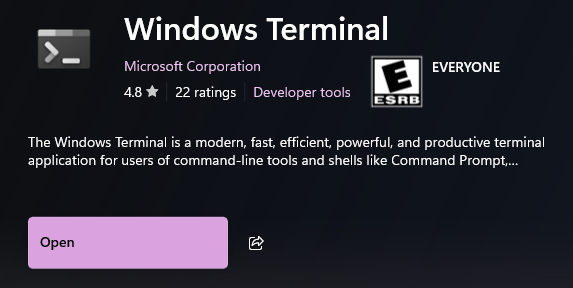

# 💻 Curso de Configuración de Entorno de Desarrollo en Windows


## 🌐 **Navegadores**

Los navegadores sirven para **visitar sitios web**. Se conectan a un servidor a través de una petición **HTTP** o **HTTPS** (*Hypertext Transfer Protocol*), obteniendo información y renderizándola en el sitio web.  

### 🤔 **¿Por qué las páginas se ven igual en distintos navegadores?**

En un inicio, las páginas se veían diferentes en cada navegador, ya que cada uno tenía su propia forma de interpretar una página web. Con el tiempo, esto **se estandarizó** gracias a la creación de HTML para estructurar páginas web y **CSS** para definir el estilo visual. Esto permitió que los navegadores **se pusieran de acuerdo** y mostraran sitios de manera uniforme.  

Además, los navegadores se encargan de ejecutar **JavaScript**, el cual permite generar interacción y dinamismo en los sitios web.  

#### 🛠️ **3 elementos clave para una página web**

1. **HTML** - Estructura la página.  
2. **CSS** - Da estilo y diseño visual.  
3. **JavaScript** - Añade interacción y dinamismo.  

### 🚀 **Ejemplo: Google Chrome**

  

Google Chrome es un ejemplo de navegador moderno. Cuenta con **3 versiones principales**:  

1. **Stable** ✅  
   - Es la versión **estable** de Chrome y se descarga por defecto.  
2. **Dev** 🛠️  
   - Versión de **desarrollo** que permite probar código en futuras versiones estables de Chrome (entre **9 a 12 semanas** antes de su lanzamiento).  
3. **Canary** 🧪  
   - Es una versión **experimental**, no recomendada para trabajar en producción debido a su inestabilidad.  

### 🔗 **Estándares y motores de navegación**

Una gran ventaja es que muchos navegadores utilizan el mismo **motor de Chrome**, conocido como **Chromium**, lo cual ayuda a establecer un **estándar común** para el desarrollo de sitios web.

## 🐧 **WSL 2 (Windows Subsystem for Linux)**  

**WSL 2** es una herramienta que permite tener el **kernel de Linux** funcional en Windows. Esto es especialmente útil porque, históricamente, muchos sistemas y herramientas de desarrollo web, backend, frontend, e incluso videojuegos se basan en Linux o macOS.  

Microsoft se dio cuenta de que estaba perdiendo parte del público desarrollador, así que integró Linux como una herramienta dentro de Windows.  

### 🔧 **Instalación de WSL 2**  

Para instalar WSL 2, sigue estos pasos:  

1. **Instala Windows Terminal desde la Microsoft Store**  
   Esta herramienta es ideal porque permite personalizar muchas configuraciones mediante un archivo **JSON**.  

     

2. **Ejecuta el siguiente comando en una terminal:**

   ```bash
   wsl --install
   ```

   - El sistema solicitará varios permisos, **acéptalos**.  
   - Una vez completado, la instalación estará lista.  

---

### ⚠️ **Solución de errores comunes**  

#### 🔄 **Error de Virtualización**  

Si ocurre un error relacionado con la **virtualización**, sigue estos pasos:  

1. Abre **PowerShell** como **Administrador**.  
2. Ejecuta el siguiente comando para habilitar las características de máquinas virtuales:  

   ```bash
   dism.exe /online /enable-feature /featurename:VirtualMachinePlatform /all /norestart
   ```  

---

#### 🛡️ **Error 0x80370114**  

Este error puede ocurrir al iniciar **Ubuntu** por primera vez. Aquí hay dos posibles soluciones:  

##### **Solución 1: Ajustar la seguridad de Windows**  

1. Abre **Windows Security**.  
2. Ve a **App & Browser Control**.  
3. Haz clic en **Exploit Protection Settings**.  
4. Selecciona la pestaña **Program settings**.  
5. Busca `C:\WINDOWS\System32\vmcompute.exe`.  
6. Haz clic en **Edit** y ajusta la configuración.  

##### **Solución 2: Activar características de Windows**  

1. Abre **"Turn Windows features on or off"** (Activar o desactivar características de Windows).  
2. Activa las siguientes opciones:  
   - **Windows Subsystem for Linux**  
   - **Virtual Machine Platform**  
   - **Windows PowerShell 2.0**  
3. Aplica los cambios y **reinicia la computadora**.  

### 🧑‍💻 **Configuración de la Cuenta Unix**  

Una vez solucionados los errores:  

1. Al iniciar Ubuntu por primera vez, el sistema te pedirá **crear una cuenta Unix**.  
2. Configura un **usuario y contraseña**.  

¡Listo! Ahora tendrás la **terminal Linux disponible** dentro de Windows. 🎉  
