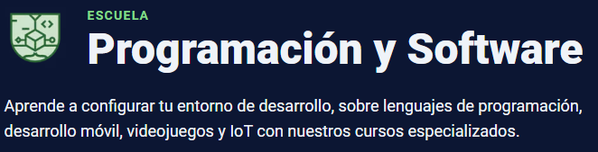

# 🖥️ Programación y Software

📅 **Fecha:** 16 de diciembre de 2024  
🔗 **Enlace de la escuela:** [Programación & Software](https://platzi.com/escuela/programacion-software/ "Ir al curso")

---

## 📌 Contenidos Principales

1. **🔰 Fundamentos de Programación**  
   Aprende desde cero cómo configurar tu entorno de trabajo y adquiere las bases esenciales antes de sumergirte en un lenguaje de programación o empezar tu primer proyecto.  

2. **💻 Lenguajes de Programación**  
   Descubre los principales lenguajes de programación y sus aplicaciones. Domina tecnologías como **Rust**, **Java**, **C#**, **PHP**, **Python** y **JavaScript** para potenciar tus proyectos.  

3. **📱 Desarrollo de Aplicaciones Móviles**  
   Crea aplicaciones para Android, iOS o multiplataforma. Conviértete en un desarrollador integral y diseña soluciones innovadoras para dispositivos móviles.  

4. **🎮 Desarrollo de Videojuegos**  
   Diseña y programa videojuegos en 2D y 3D utilizando **Unity**. Aprende desde los fundamentos hasta el desarrollo de juegos multijugador en línea.  

5. **🌐 Programación para Proyectos IoT**  
   Combina hardware y software en proyectos innovadores. Explora conceptos de electricidad, electrónica, programación en **C**, y trabaja con dispositivos como **Arduino** y **ESP32**.  

---

## 🧪 Avance del Curso

En esta sección se documentarán los proyectos y prácticas realizadas durante el curso.  
🔗 **Enlaces a repositorios:** ¡Próximamente! 🚀
